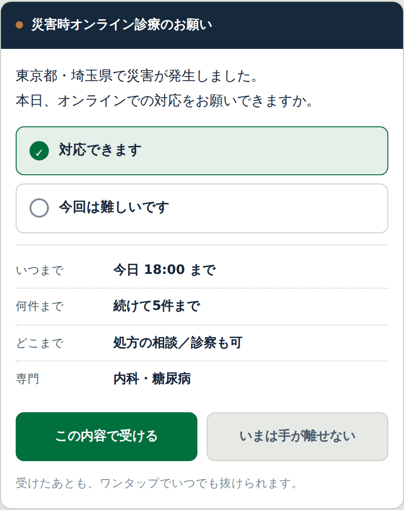
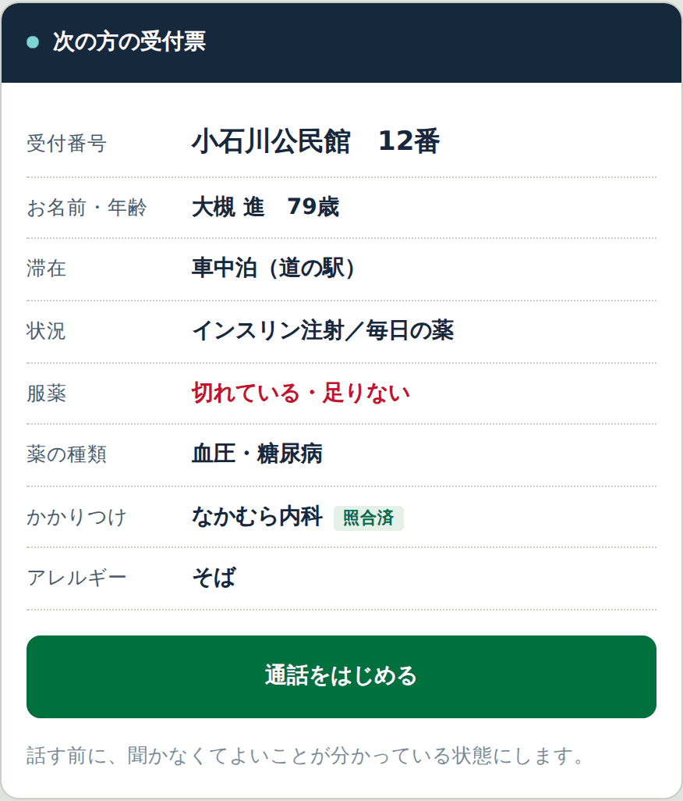

# 避難所の受付は、その人が薬を切らしていることを聞かない

**この記事について**

避難所の受付は、名前と住所を聞きますが、その人が薬を切らしていることは聞きません。聞いても、次に何をするかが決まっていません。調べてみると、被災者を登録する仕組みも、医療者どうしをつなぐ仕組みもありましたが、**登録された人の困りごとが医療者に流れていく経路**が見つかりませんでした。

そこで、受付を入口にして、被災していない地域の医師につなぐ仕組みを考え、動く試作を作りました。ただ、中心となる機能はまだ実装できていません。

私は医師でも自治体職員でもありません。**この構想を引き取ってくれる人をさがしています。**

（約8,000字。急ぐ方は「考えた仕組み」から読んでください）

## 郵便局の記事から始まった

石川県七尾市の南大吞郵便局が、オンライン診療の拠点になっているという記事を読んだ。総務省の「郵便局等の公的地域基盤連携推進事業」の第1号で、週2回の予約制。局員がPCの操作を手伝う。本人確認は、マイナンバーカードを画面越しに見せる。

面白いと思ったのは、最後のところだった。カードを撮影して保存するのではなく、その場で見せて、終わり。記録を残さない本人確認。

これを災害時に持ち込めないか、と考えはじめた。そして、調べて、動く試作まで作った。以下はその過程で分かったことと、作りながら迷ったことです。

## 避難所の受付が聞いていないこと

避難所の受付では、名前と住所と家族構成を書く。内閣府の作業グループがまとめた被災者アセスメント調査票には、基本情報・被災状況・現在の状況・医療サポート・要配慮者情報という項目が並んでいる。項目としては、医療のことも入っている。

ただ、それは行政の記録として集められる。集められたあと、その人が今日じゅうに血圧の薬を飲めるかどうかは、別の話になる。

受付に立っている人は、その場では判断しない。しても、次に何をすればいいのかが決まっていない。

## 名簿に載らない人たち

2016年の熊本地震では、車中泊を経験した人が68.3%いた。避難者数の集計に車中泊は含まれず、どこに誰がいるのか把握が難しかった。

能登半島地震では、NTTドコモが避難所にタブレットを提供し、2024年2月時点で23か所で運用されていた。回線と端末は、実際に届いている。

2025年12月に公表された首都直下地震の被害想定では、死者1.8万人、医療の「要対処人口」は最大8.6万人とされている。

数字だけ並べると、同じ問題に見える。でも、実際には都市の型で姿が違う。

**車社会の地方都市**では、車中泊が主役になる。駐車場が広く、車を持っている人が多い。熊本の68.3%はこれだ。

**大都市**では、規模が桁違いになる。加えて帰宅困難者と、高層階の在宅避難。避難所に来ない理由が、車ではなく建物になる。

**積雪寒冷地**では、また違う。2018年の北海道胆振東部地震は午前3時7分に発生し、3時25分には北海道全域が停電した。全道の停電が復旧したのは約64時間後の9月8日19時。冬に同じことが起きれば、車中泊は排気管が雪で塞がれる危険と隣り合わせになる。

共通しているのは一点だけだ。**避難所の名簿に載らない人に、医療が届かない。**

## これまで、薬が切れたらどうしていたか

では、名簿に載らない人が薬を切らしたとき、これまではどうしていたのか。

経路は、すでにある。

自治体の案内では、被災時の薬の入手方法として3つが挙げられている。かかりつけの病院や薬局に連絡する。避難所で開設している救護所に相談する。避難所を管理しているスタッフに相談する。

大規模災害で受診が難しい場合には、お薬手帳などで普段の薬が確認できれば、処方箋なしでも薬局で渡せる特例が認められることがある。東日本大震災でも、能登半島地震でも適用された。避難所では災害処方箋も発行される。

制度も、経路も、ある。

ただ、調べていて引っかかったことが4つあった。

**1. 緊急医療救護所は、避難所ではなかった。**

荒川区が配っているチラシに、はっきり書いてある。「※避難所ではありません」。

緊急医療救護所は病院の前などに開設される。荒川区の場合は6か所で、うち5か所が病院前、1か所が小学校だ。発災からおおむね6時間〜72時間、トリアージと応急処置、重症者・中等症者の搬送を行う。

つまり、**避難所にいる人は、そこまで移動しなければならない。** 車中泊の人はなおさらだ。

**2. そこは、外傷のための場所だった。**

トリアージの区分は赤・黄・緑。緑は「歩行可能で、今すぐの処置や搬送の必要ないもの」とされている。軽症と判断された人には応急処置と医薬品の処方が行われ、応急処置後は、混乱を防ぐために帰宅か避難所へ移動してもらう。

**薬が切れた人は、赤にも黄にも緑にも入らない。**

**3. 避難所の医療救護所は、72時間以降だった。**

品川区の例では、発災後72時間以降からおおむね1週間までの間、区立学校等13か所の保健室等に医療救護所が設置される。区内の避難所はもっと多いので、全部には置かれない。

3日分の薬を持ち出せていれば、ちょうど切れるころに開く。持ち出せていなければ、間に合わない。

**4. その間、通常の診療は行われない。**

荒川区のチラシにはこうある。緊急医療救護所の開設時は、原則として一部の医療機関を除き、通常診療は行われません、と。

つまり「かかりつけに連絡する」という1つ目の選択肢が、災害直後にはいちばん使いにくい。

熊本地震では死者276人のうち221人が災害関連死で、その大半が70歳以上だった。緑に見えて、数日後に亡くなる人がいる。

**この谷間を埋めるものが、すでにあるのではないか。** そう思って、調べた。

## 既存の仕組みを調べた

先に、すでにあるものを調べた。公開されている資料で確認できた範囲を、表にしてみる。いちばん下の行が、私が作った試作（詳しくは後半）です。

| | 名簿を つくる | 車中泊・在宅 を登録する | 医療の困りごと を聞き取る | 医師に つなぐ | 薬を 手配する | 安否照会 に答える |
|---|:-:|:-:|:-:|:-:|:-:|:-:|
| クラウド型被災者支援システム （内閣府／J-LIS） | ○ | △ | △ | × | × | △ |
| D-VICS | ○ | ○ | ○ | × | × | ○ |
| らくらく避難所くん | ○ | ○ | × | × | × | ○ |
| Googleパーソンファインダー | × | × | × | × | × | ○ |
| J-anpi | × | × | × | × | × | ○ |
| EMIS | × | × | × | × | × | × |
| **この試作** | △ | ○ | ○ | ○ | ○ | ○ |

**表の読み方**　○＝できる　△＝一部だけ、または他のシステムと組み合わせて　×＝公開情報の範囲では確認できなかった

※ ×は、できないと断定するものではありません。誤りがあればご指摘ください。
※ この試作の「名簿をつくる」が△なのは、受付票は出せるものの、入退所の管理そのものは既存システムに任せる前提だからです。

それぞれ、よくできている。

**D-VICS**は特に近い。厚生労働科学特別研究事業で開発されたもので、LINEの中でアセスメント調査票を入力でき、チャットボットで安否確認や避難場所の登録ができる。データはCSVで出せるので、台帳機能を持つシステムとの連携もできる。支援ニーズの把握までは、すでに届いている。

**この試作が足したいのは、その先の1歩だ。** 聞き取ったニーズを行政や保健の側に集約するところまでは、D-VICSがやっている。集約されたあと、その人を医師につなぐところが空いている。逆に言えば、D-VICSに医療への導線を足すのでも目的は果たせる。私が作ったものである必要はない。

**らくらく避難所くん**も、受付の中で在宅避難や車中泊の状況を登録でき、避難所に来ない住民の安否確認ができる。公開を希望した避難者の避難先をホームページに出すこともできる。受付のところは、かなり作り込まれている。すでに自治体に導入されているものに医療の導線を足すほうが、新しいものを1から入れてもらうより現実的だとも思う。

**EMIS**（広域災害・救急医療情報システム）は、医療機関の被災状況やDMATの活動、搬送患者を関係者間で共有する。ただし利用者は厚生労働省・都道府県・医療機関・医療支援チームで、**避難所にいる個人は登場しない。**

## 5年前に、同じことを考えた人がいた

調べているうちに、新聞記事に行き当たった。

2021年、DMATの隊員で神戸学院大の中田敬司教授（災害医療）らが、避難所の人を地元の医療機関にオンライン診療してもらい、薬が届く仕組みを考案していた。記事にはこう書かれている。避難所では、かかりつけ医の診察を受けることが難しく、薬の処方が受けられない場合も多い、と。

**私が言おうとしていたことと、同じだ。**

しかも実地で試している。2020年7月の九州豪雨で被害が出た熊本県人吉・球磨地域の避難所で、電話を使って試行。車が浸水して通院できない人たちが受診し、薬が届いたという。

仕組みはこうだ。被災地でオンライン診療に対応し、いち早く復旧した医療機関をリスト化して避難所に掲示する。受診を希望する人はその中から医療機関を選ぶ。避難所に薬を届けられる薬局のリストも作り、医師は近くの薬局に処方箋を送る。

考えたことは、新しくなかった。

ただ、違うところが3つある。

| | 中田教授らの仕組み（2021） | この試作 |
|---|---|---|
| 誰が診るか | 被災地で復旧した医療機関 | 被災していない地域の医師 |
| どう選ぶか | 掲示されたリストから、本人が選ぶ | 待ち時間の長い順に、自動で割り当てる |
| 入口 | 避難所に掲示されたリスト | 避難所の受付、および巡回 |

被災地の医療機関に頼ると、その地域が大きく被災したときに成り立たない。全国から集めれば、規模の制約がなくなる。一方で、地元の医師のほうが土地勘があり、かかりつけである可能性も高い。**どちらが良いという話ではなく、両方あっていい。**

記事には「各地の医師会などに協力を呼びかけ、災害関連死の防止につなげたい」とある。広域化の意図は、はじめからあったようだ。

5年経って、この仕組みがサービスとして動いているのを私は見つけられなかった。私の探し方が悪いのかもしれないし、どこかで止まっているのかもしれない。**もし続きをご存じの方がいたら、教えてください。**

## 避難者から見ると、どうなっているか

もうひとつ、気になったことがある。**避難している本人は、これらのサービスにどこで出会うのか。**

| | どこで出会うか | 何をするか |
|---|---|---|
| クラウド型被災者支援システム | 出会わない | 受付で書いた紙を、職員が入力する |
| D-VICS | 自治体が案内するLINE | 自分で調査票を入力。チャットボットで安否や避難場所を登録 |
| らくらく避難所くん | 避難所の受付 | マイナンバーカードや免許証をかざす。事前登録のQR、掲示のQRを自分のスマホで読む、音声、紙 |
| Googleパーソンファインダー | 自分で検索して たどりつく | 自分の名前を登録する。探す側は名前で検索する |
| J-anpi | 同上 | 電話番号や名前で検索する |
| EMIS | 出会わない | ― |
| **この試作** | 避難所の受付。 車中泊の車まで巡回スタッフが行く | 画面の質問に答える。医師と話したいときは受付番号を受け取り、掲示に番号が出たら呼ばれる |

※ 「らくらく避難所くん」（テレネット）と「らくらく避難所」（別会社）は名前が似ていますが別のサービスです。上の表は前者です。

並べてみて、はっきりしたことがある。

**避難者が自分で何かをするのは、受付の1回だけ。** そしてその1回でできるのは、名簿に載ることだけだ。名簿に載ったあと、体調が悪くなっても、薬が切れたことに気づいても、もう一度何かを入力する場所がない。

D-VICSはLINEなので繰り返し使えるが、避難所でこれを案内されたことがある人が、どれくらいいるだろうか。

受付は、一度きりの手続きになっている。**そこを、何度でも戻ってこられる窓口にしたい。**

## いま起きていること

つまり、こういうことだと思う。

- 被災者を登録する仕組みはある
- 医療者どうしをつなぐ仕組みもある
- でも、**登録された被災者の困りごとが、医療者の側に流れていく経路がない**

聞き取ったあと、その人が今日じゅうに薬を受け取れるかどうかは、結局その場の人の判断と手作業になっている。

私の見落としかもしれない。もしご存じの方がいたら、それだけでも教えてほしい。実際、このあと見落としが1つ見つかった。

## すでにある仕組みの、あいだを埋めます

ここまで調べたうえで、作ろうとしているものの位置を書いておく。

この仕組みは、救護所の代わりではない。**外傷は救護所へ。** そこは変えない。

受けたいのは、赤黄緑のどこにも入らないものだ。

- 薬が切れた、足りない
- 眠れない、気持ちがつらい
- 持病のことで相談したい
- この症状は受診したほうがいいのか判断がつかない

そして、救護所がある避難所でも使えたほうがいいと思っている。救護所には開設時間があり、医師が24時間いるわけではない。夜中に薬が切れたことに気づいた人が、翌朝まで待つ理由はない。

**発災直後から使えて、避難所の外にも出ていける。** 救護所が立ち上がったら、そちらに引き継げばいい。

## 考えた仕組み

受付を入口にして、そこで行き先を分ける。

1. **医療のこと**（からだ／こころ）→ 医師とのオンライン診療、または薬のリクエスト
2. **生活のこと**（物資、住まい、手続き）→ 行政の窓口へ
3. **人をさがす** → 探し人の掲示へ

診るのは、**被災していない地域の医師**にしたい。被災地の医師は、その場の急性期対応で手一杯になる。一方、慢性疾患の薬が切れた人、眠れない人、持病の相談は、被災地にいなくても対応できる。

全国の医師に、待機を登録してもらう。登録するのは4つだけにしたい。

1. **いつ対応できるか** ── 「今日18:00まで」「21:00〜24:00の夜間だけ」「土日のみ」「いまから30分だけ」
2. **何件まで受けるか** ── 「続けて5件まで」「1件だけ」「1件20分まで」
3. **どこまでやるか** ── 「処方の相談まで。診察はしない」「診察も可」
4. **専門と、対応できる内容** ── 「糖尿病・高血圧の処方相談」「眠れない・不安の相談」「子どもの発熱」

短い時間でも、1件だけでも登録できるようにしたい。まとまった時間を空けられる人は多くないが、30分なら出せる人は多いはずだ。**細切れの善意を集めれば、全体としては切れ目がなくなる。**

そうして集まった医師に、避難所の待ち行列から順に割り当たる。避難所ごとに医師を貼り付けるのではなく、全体で1本の列にする。ここがこの構想の中心で、**そして、まだ実装できていない部分でもある。**

医師の側から見ると、こうなる予定だ。発災時に問い合わせが届き、答えた医師だけが受け皿に入る。順番が回ってきたら、通話の前に受付票が届く。**話す前に、聞かなくてよいことが分かっている状態にしたい。**

※ 医師の側の画面は、こう作りたいというイメージで、まだ実装していません。

## 設計で迷ったこと

作りながら、判断に困ったところを書いておく。ここが一番、他の人の意見を聞きたい。

**緊急度を掲示しない。** 待ち状況のモニターには番号だけを出す。名前も出さないし、急いでいるかどうかも出さない。最初は赤で色分けしていたが、やめた。「あの人は重症だ」が公開情報になってしまう。急ぐ理由（薬切れ、配送の締め切りが近い）は、スタッフの画面にだけ出す。

**選ぶ前に、行き先を見せない。** 「息が苦しい」を選ぶと119番につながる、と先に書いてしまうと、大ごとにしたくない人が選ばなくなる。だから選択肢だけを出して、選んだあとに行き先を示す。そして、そこで受付を止めない。

**お薬手帳は撮影しない。** 通話中にカメラへかざしてもらう。郵便局のマイナンバーカードと同じ発想で、こうすると「画像を何日保存するか」という議論が丸ごと消える。書見台があると使いやすい。

**診療記録をシステムに持たない。** 医師の所見や処方は、この仕組みには保存しない。受付票は端末の中に置いて、CSVで出す。医療系と行政系でデータの行き先を分ける。入口は1つ、記録の行き先は2つ。

**「たずねてこられた方への対応」を全員に聞く。** 在所を開示していいかどうか。理由は聞かない。DVや、事情のある人がいる。

## 災害時の特例のこと

調べていて知ったこと。

薬機法49条1項の「正当な理由」により、災害時には処方箋がなくても医療用医薬品を交付できる。令和8年熊本地震でも2026年7月29日付で事務連絡が出ている。被災地では初診からのオンライン診療も認められている。処方箋なしでも、事後発行を条件に保険調剤ができる。

制度の側は、思っていたより開いていた。足りないのは、それを使うための導線のほうだった。

## 動くものを作った

HTMLファイル1つで動く試作を作った。ログイン不要で、ブラウザで開けば動く。

受付の3ルート、待ち状況の掲示、呼び出しの操作、車中泊や在宅の人を巡回して登録する画面、薬のリクエストと配送の管理、探し人の掲示、通話画面。端末は役割を選べる（受付／診察／掲示／巡回）。

深夜の交代要員がログインで詰まるのが一番怖いので、認証は当面入れていない。ここは、実運用では端末登録型にする必要がある。

## まだできていないこと

- 全避難所の待ち行列をサーバーで集約し、空いた医師に自動で割り当てる（**中心の機能**）
- 医師の待機登録と、ワンタップでの離脱
- 二重割り当ての防止、無応答時の転送
- 同じ避難所の端末どうしの同期
- オフラインで受けた分の後送
- 自治体システムとのCSV／API連携
- 端末登録型の認証、医師側の本人確認
- 実際の映像通話SDKの組み込み
- 番号を忘れた人の本人確認

つまり、構想の骨格しかない。

## 受け取ってくれる人をさがしています

私は医師でも、自治体の職員でも、防災の専門家でもない。札幌でソフトウェアを書いている一般人です。

この仕組みは、私一人では絶対に動かない。避難所に置くのも、医師を集めるのも、自分ではできない。

だから、この構想を引き取ってくれる人をさがしています。改変してもらってかまいません。名前が残らなくてもかまいません。「そこは違う」という指摘だけでもありがたいです。

災害医療の現場を知っている方、自治体の防災担当の方、オンライン診療をやっている先生。もし少しでも引っかかるところがあれば、連絡をください。

試作はここに置いています。

- 説明ページ：（URL）
- 試作：（URL）
- ソース：（URL）

---

※ 本文中の数値や制度の記述は公表資料をもとにしていますが、引用の正確さについては原典をご確認ください。誤りがあればご指摘いただけると助かります。
